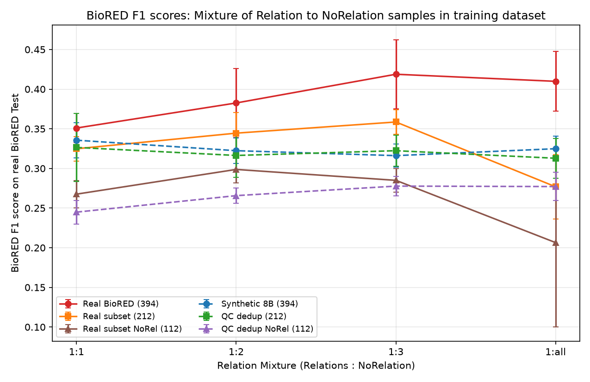
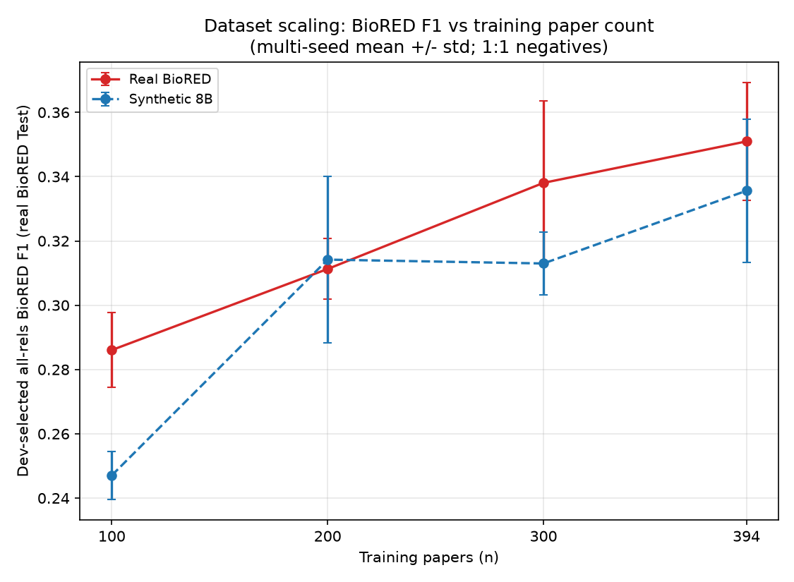
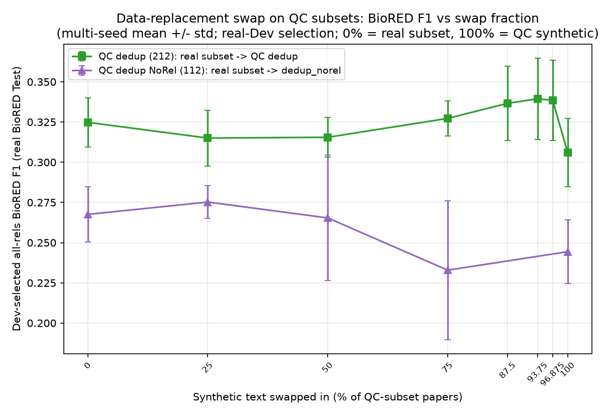
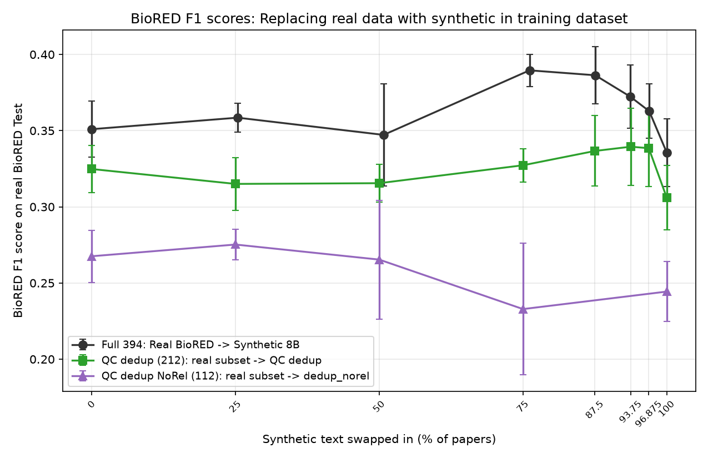

# 21 Multi-seed means: run-to-run variance of five C5 experiments

The reseeded runs (report 20) still show sizeable run-to-run variance: two identical seed-42 Real BioRED runs differed by ~0.02 Dev-selected all-rels. from fp16 GPU nondeterminism alone.
To get stable numbers we take several measurements per experiment (different training seeds) and report the mean and variance.

## Method

- Five experiments: Real BioRED (394), Synthetic Qwen3-8B (394), QC dedup (212), Random 212, Real subset (212 QC papers).
- Recipe: seeded C5 (`canonical_train.py --prune-checkpoints`); `--seed` sets both the classifier-head init and the HF data-shuffling seed, everything else fixed at C5.
- Metric: Dev-selected all-relations BioRED F1 on the real BioRED Test (headline); Dev-sel matched is secondary.
- Five measurements per experiment: seeds **69, 21, 16** (new sweep), **42** (the report-20 seeded initial run), and **1509** (the pseudo-random baseline seed that fills the 5th column - see the seed-1509 overhaul below, which replaced the original unseeded report-12 run).
- Real BioRED has two seed-42 runs (the report-20 baseline plus a reproducibility rerun); one is disregarded so every experiment contributes exactly one seed-42 measurement.
- Run order: one run per experiment in round 1 (seed 69), then round 2 (seed 21), then round 3 (seed 16).
- Hardware: runs split across the local 8 GB GPU and the external RTX 3060 (12 GB). The external card is forced to the local batch-16 / LR-2.5e-5 recipe via `C5_PIN_HALF=1`, and was validated by reproducing the local seed-42 Real BioRED number before use.
- Tables generated by `finetuning/collect_mean.py`. The Base and Dataset-scaling sections are spliced from its output; the QC-subset swap and negative-ratio-QC sections are hand-formatted, so do NOT run `update_report21.py` (it regenerates the whole region and drops that formatting) - edit those sections by hand.
- Negative-ratio sweep on QC subsets (added later): the report-12 negative-ratio sweep repeated on the two synthetic QC subsets (`dedup` 212, `dedup_norel` 112) and their real-text counterparts (`real_subset` 212, `real_subset_norel` 112), at ratios 1:2 / 1:3 / 1:all.
- That group uses seeds **69, 21, 42** and the pseudo-random **1509** (which fills the "random / s1509" column, matching the base `real_subset_norel` convention); the 1:1 anchors are the corresponding QC-arm rows in the base table above.
- Data-replacement swap on QC subsets (added later): the report-13 abstract swap repeated on the two QC subsets instead of the full 394 set.
  Start from the real-text endpoint (`real_subset` 212, `real_subset_norel` 112) and replace 25 / 50 / 75 percent of those papers' text with that arm's QC-passing synthetic generation (the exact highest-`mean_prob` passing gen each paper trains on, raw, not gen1), so the 0 percent endpoint is the base-table `Real subset` row and the 100 percent endpoint is the base-table QC synthetic row (`QC dedup` / `QC dedup NoRel-aware`).
  As in report 13 the pair set is invariant (golds + distance-matched negatives on the real annotations only), so it is a pure text interpolation; the swapped subset is a single seed-42 nested draw (25 ⊂ 50 ⊂ 75 percent), fixed across training seeds.
  Selection is on the full real BioRED Dev throughout (the 0 percent endpoint's axis); the base-table 100 percent QC synthetic rows were selected on the synthetic Dev (marked `synth-Dev, old`), so the two arms were also re-run on real BioRED Dev (the `real-Dev` rows) to give a single-axis 100 percent endpoint - the one the swap-gradient plot uses.
  Seeds **69, 21, 42** and pseudo-random **1509** (fills the "random / s1509" column); built via `canonical_train.py --qc-swap-arm {dedup,dedup_norel} --swap-frac {25,50,75}`.
- Real-Dev re-run of the QC synthetic arms (added later): `dedup` (212) and `dedup_norel` (112) re-trained on the same synthetic QC text but with the checkpoint selected on the full real BioRED Dev instead of the synthetic Dev, so they share the swap gradient's selection axis (`canonical_train.py --qc-arm {dedup,dedup_norel} --dev-source biored`). Reported as the `real-Dev` base rows next to the original `synth-Dev, old` rows; seeds **69, 21, 16, 42** and pseudo-random **1509**. Real-Dev selection lowers QC dedup (0.326 synth-Dev -> 0.306 real-Dev, now level with random-212 0.324 / real-subset 0.325) and leaves QC dedup NoRel unchanged (0.245 -> 0.244).
- Seed-1509 baseline overhaul (added later): the whole baseline table was re-run at the pseudo-random seed **1509**, which now fills the 5th "random / s1509" column in place of the original unseeded report-12 run (kept on disk, dropped from the report), so all five base-table columns are known seeds (69/21/16/42/1509). This shifts the baseline means slightly (Real 0.341 -> 0.351, Synth 8B 0.328 -> 0.336, Synth 4B 0.329 -> 0.327, random-212 0.315 -> 0.324, real-subset 0.317 -> 0.325, QC dedup synth-Dev 0.333 -> 0.326); every table that anchors on the base rows (negative-ratio 1:1, scaling n394, swap endpoints, qcswap 0%) inherits the update. Side-experiment rows (neg-ratio 1:2/1:3/1:all, scaling n100-300, swaps) keep their prior-report random column.
- Train+dev scaling (added later): fold each source's own Dev split into its training set (Real 8,334 -> 10,657 rows; Synth similarly), train 5 epochs, and - since no Dev is left to select on - evaluate the checkpoint fixed to that seed's baseline-394 Dev-selected epoch (`canonical_train.py --include-dev-in-train --fixed-epoch N`; real epochs 4/2/4/3, synth 5/5/5/5 for seeds 69/21/42/1509). Real & Synthetic 8B, seeds 69/21/42/1509; reported as the `Real 394 + Dev` / `Synth 8B 394 + Dev` rows of the dataset-scaling table.

<!-- MEAN:START -->
## Base sources and QC arms

### Dev-selected all-relations BioRED F1 (headline)

| Experiment | seed 69 | seed 21 | seed 16 | seed 42 | random (prior report / s1509) | n | mean | variance | std |
|---|:-:|:-:|:-:|:-:|:-:|:-:|:-:|:-:|:-:|
| Real BioRED (394) | 0.345 | 0.352 | 0.382 | 0.325 | 0.350 | 5 | 0.351 | 0.00034 | 0.018 |
| Synthetic Qwen3-8B (394) | 0.357 | 0.348 | 0.294 | 0.346 | 0.333 | 5 | 0.336 | 0.00049 | 0.022 |
| Synthetic Qwen3-4B (394) | 0.290 | 0.339 | 0.295 | 0.378 | 0.332 | 5 | 0.327 | 0.00102 | 0.032 |
| QC dedup (212, synth-Dev, old) | 0.385 | 0.323 | 0.357 | 0.260 | 0.307 | 5 | 0.326 | 0.00183 | 0.043 |
| QC dedup (212, real-Dev) | 0.323 | 0.283 | 0.329 | 0.278 | 0.317 | 5 | 0.306 | 0.00045 | 0.021 |
| QC dedup NoRel-aware (112, synth-Dev, old) | 0.268 | 0.245 | 0.221 | 0.246 | 0.245 | 5 | 0.245 | 0.00022 | 0.015 |
| QC dedup NoRel-aware (112, real-Dev) | 0.276 | 0.234 | 0.216 | 0.248 | 0.247 | 5 | 0.244 | 0.00039 | 0.020 |
| Random 212 | 0.347 | 0.367 | 0.272 | 0.311 | 0.325 | 5 | 0.324 | 0.00104 | 0.032 |
| Real subset (212 QC papers) | 0.331 | 0.336 | 0.314 | 0.300 | 0.342 | 5 | 0.325 | 0.00024 | 0.015 |
| Real subset NoRel (112 papers) | 0.288 | 0.272 | 0.239 | 0.259 | 0.280 | 5 | 0.268 | 0.00029 | 0.017 |

### Dev-selected all-relations precision

| Experiment | seed 69 | seed 21 | seed 16 | seed 42 | random (prior report / s1509) | n | mean | variance | std |
|---|:-:|:-:|:-:|:-:|:-:|:-:|:-:|:-:|:-:|
| Real BioRED (394) | 0.239 | 0.255 | 0.280 | 0.232 | 0.251 | 5 | 0.251 | 0.00028 | 0.017 |
| Synthetic Qwen3-8B (394) | 0.302 | 0.410 | 0.298 | 0.362 | 0.316 | 5 | 0.338 | 0.00182 | 0.043 |
| Synthetic Qwen3-4B (394) | 0.338 | 0.322 | 0.274 | 0.378 | 0.311 | 5 | 0.324 | 0.00117 | 0.034 |
| QC dedup (212, synth-Dev, old) | 0.370 | 0.280 | 0.413 | 0.375 | 0.262 | 5 | 0.340 | 0.00344 | 0.059 |
| QC dedup (212, real-Dev) | 0.397 | 0.262 | 0.326 | 0.295 | 0.290 | 5 | 0.314 | 0.00214 | 0.046 |
| QC dedup NoRel-aware (112, synth-Dev, old) | 0.218 | 0.184 | 0.194 | 0.183 | 0.183 | 5 | 0.192 | 0.00018 | 0.013 |
| QC dedup NoRel-aware (112, real-Dev) | 0.220 | 0.186 | 0.192 | 0.182 | 0.197 | 5 | 0.195 | 0.00018 | 0.013 |
| Random 212 | 0.307 | 0.294 | 0.397 | 0.332 | 0.429 | 5 | 0.352 | 0.00273 | 0.052 |
| Real subset (212 QC papers) | 0.253 | 0.243 | 0.224 | 0.213 | 0.256 | 5 | 0.238 | 0.00028 | 0.017 |
| Real subset NoRel (112 papers) | 0.216 | 0.197 | 0.165 | 0.188 | 0.252 | 5 | 0.204 | 0.00084 | 0.029 |

### Dev-selected all-relations recall

| Experiment | seed 69 | seed 21 | seed 16 | seed 42 | random (prior report / s1509) | n | mean | variance | std |
|---|:-:|:-:|:-:|:-:|:-:|:-:|:-:|:-:|:-:|
| Real BioRED (394) | 0.622 | 0.568 | 0.601 | 0.546 | 0.576 | 5 | 0.583 | 0.00069 | 0.026 |
| Synthetic Qwen3-8B (394) | 0.437 | 0.303 | 0.291 | 0.331 | 0.351 | 5 | 0.342 | 0.00267 | 0.052 |
| Synthetic Qwen3-4B (394) | 0.254 | 0.358 | 0.321 | 0.377 | 0.356 | 5 | 0.333 | 0.00191 | 0.044 |
| QC dedup (212, synth-Dev, old) | 0.402 | 0.382 | 0.315 | 0.199 | 0.371 | 5 | 0.334 | 0.00533 | 0.073 |
| QC dedup (212, real-Dev) | 0.272 | 0.306 | 0.333 | 0.263 | 0.349 | 5 | 0.305 | 0.00112 | 0.033 |
| QC dedup NoRel-aware (112, synth-Dev, old) | 0.349 | 0.367 | 0.256 | 0.376 | 0.369 | 5 | 0.343 | 0.00198 | 0.044 |
| QC dedup NoRel-aware (112, real-Dev) | 0.370 | 0.316 | 0.247 | 0.391 | 0.334 | 5 | 0.332 | 0.00249 | 0.050 |
| Random 212 | 0.399 | 0.486 | 0.207 | 0.291 | 0.261 | 5 | 0.329 | 0.01006 | 0.100 |
| Real subset (212 QC papers) | 0.477 | 0.547 | 0.525 | 0.508 | 0.515 | 5 | 0.515 | 0.00052 | 0.023 |
| Real subset NoRel (112 papers) | 0.432 | 0.439 | 0.433 | 0.414 | 0.316 | 5 | 0.407 | 0.00210 | 0.046 |

### Dev-selected matched BioRED F1 (secondary)

| Experiment | seed 69 | seed 21 | seed 16 | seed 42 | random (prior report / s1509) | n | mean | variance | std |
|---|:-:|:-:|:-:|:-:|:-:|:-:|:-:|:-:|:-:|
| Real BioRED (394) | 0.609 | 0.585 | 0.610 | 0.554 | 0.587 | 5 | 0.589 | 0.00042 | 0.020 |
| Synthetic Qwen3-8B (394) | 0.521 | 0.415 | 0.387 | 0.439 | 0.446 | 5 | 0.441 | 0.00201 | 0.045 |
| Synthetic Qwen3-4B (394) | 0.356 | 0.452 | 0.405 | 0.484 | 0.445 | 5 | 0.428 | 0.00193 | 0.044 |
| QC dedup (212, synth-Dev, old) | 0.500 | 0.460 | 0.428 | 0.299 | 0.442 | 5 | 0.426 | 0.00459 | 0.068 |
| QC dedup (212, real-Dev) | 0.377 | 0.392 | 0.425 | 0.357 | 0.427 | 5 | 0.396 | 0.00073 | 0.027 |
| QC dedup NoRel-aware (112, synth-Dev, old) | 0.406 | 0.388 | 0.326 | 0.404 | 0.396 | 5 | 0.384 | 0.00088 | 0.030 |
| QC dedup NoRel-aware (112, real-Dev) | 0.421 | 0.359 | 0.318 | 0.408 | 0.374 | 5 | 0.376 | 0.00134 | 0.037 |
| Random 212 | 0.483 | 0.536 | 0.307 | 0.389 | 0.371 | 5 | 0.417 | 0.00668 | 0.082 |
| Real subset (212 QC papers) | 0.516 | 0.560 | 0.535 | 0.521 | 0.540 | 5 | 0.534 | 0.00024 | 0.016 |
| Real subset NoRel (112 papers) | 0.475 | 0.468 | 0.433 | 0.437 | 0.402 | 5 | 0.443 | 0.00069 | 0.026 |

## Data replacement / abstract swap (report 13); swap 0 = Real BioRED, swap 394 = Synthetic 8B

### Dev-selected all-relations BioRED F1 (headline)

| Experiment | seed 69 | seed 21 | seed 16 | seed 42 | random (prior report / s1509) | n | mean | variance | std |
|---|:-:|:-:|:-:|:-:|:-:|:-:|:-:|:-:|:-:|
| Swap 100 | 0.359 | 0.373 | - | 0.356 | 0.346 | 4 | 0.359 | 0.00009 | 0.010 |
| Swap 200 | 0.374 | 0.294 | - | 0.342 | 0.378 | 4 | 0.347 | 0.00113 | 0.034 |
| Swap 300 | 0.384 | 0.387 | - | 0.408 | 0.381 | 4 | 0.390 | 0.00011 | 0.011 |

### Dev-selected all-relations precision

| Experiment | seed 69 | seed 21 | seed 16 | seed 42 | random (prior report / s1509) | n | mean | variance | std |
|---|:-:|:-:|:-:|:-:|:-:|:-:|:-:|:-:|:-:|
| Swap 100 | 0.253 | 0.268 | - | 0.253 | 0.245 | 4 | 0.255 | 0.00007 | 0.008 |
| Swap 200 | 0.270 | 0.205 | - | 0.243 | 0.277 | 4 | 0.249 | 0.00081 | 0.028 |
| Swap 300 | 0.296 | 0.295 | - | 0.313 | 0.292 | 4 | 0.299 | 0.00006 | 0.008 |

### Dev-selected all-relations recall

| Experiment | seed 69 | seed 21 | seed 16 | seed 42 | random (prior report / s1509) | n | mean | variance | std |
|---|:-:|:-:|:-:|:-:|:-:|:-:|:-:|:-:|:-:|
| Swap 100 | 0.619 | 0.614 | - | 0.599 | 0.591 | 4 | 0.606 | 0.00013 | 0.011 |
| Swap 200 | 0.611 | 0.524 | - | 0.577 | 0.595 | 4 | 0.577 | 0.00109 | 0.033 |
| Swap 300 | 0.543 | 0.561 | - | 0.586 | 0.545 | 4 | 0.559 | 0.00029 | 0.017 |

### Dev-selected matched BioRED F1 (secondary)

| Experiment | seed 69 | seed 21 | seed 16 | seed 42 | random (prior report / s1509) | n | mean | variance | std |
|---|:-:|:-:|:-:|:-:|:-:|:-:|:-:|:-:|:-:|
| Swap 100 | 0.621 | 0.619 | - | 0.603 | 0.588 | 4 | 0.608 | 0.00018 | 0.013 |
| Swap 200 | 0.634 | 0.533 | - | 0.577 | 0.613 | 4 | 0.589 | 0.00146 | 0.038 |
| Swap 300 | 0.590 | 0.590 | - | 0.622 | 0.583 | 4 | 0.596 | 0.00022 | 0.015 |

### Data replacement / abstract swap on QC subsets (report 21 extension); swap 0% = Real subset row, 100% = QC synthetic row

#### Dev-selected QC all-relations BioRED F1 (headline)

| Experiment | seed 69 | seed 21 | seed 16 | seed 42 | random (prior report / s1509) | n | mean | variance | std |
|---|:-:|:-:|:-:|:-:|:-:|:-:|:-:|:-:|:-:|
| QC dedup swap 25% | 0.307 | 0.304 | - | 0.304 | 0.345 | 4 | 0.315 | 0.00030 | 0.017 |
| QC dedup swap 50% | 0.329 | 0.313 | - | 0.324 | 0.296 | 4 | 0.316 | 0.00015 | 0.012 |
| QC dedup swap 75% | 0.328 | 0.311 | - | 0.328 | 0.342 | 4 | 0.327 | 0.00012 | 0.011 |
|
| QC dedup NoRel swap 25% | 0.279 | 0.286 | - | 0.259 | 0.277 | 4 | 0.275 | 0.00010 | 0.010 |
| QC dedup NoRel swap 50% | 0.284 | 0.269 | - | 0.202 | 0.307 | 4 | 0.265 | 0.00152 | 0.039 |
| QC dedup NoRel swap 75% | 0.273 | 0.258 | - | 0.241 | 0.161 | 4 | 0.233 | 0.00187 | 0.043 |

### Dev-selected all-relations precision

| Experiment | seed 69 | seed 21 | seed 16 | seed 42 | random (prior report / s1509) | n | mean | variance | std |
|---|:-:|:-:|:-:|:-:|:-:|:-:|:-:|:-:|:-:|
| QC dedup swap 25% | 0.218 | 0.218 | - | 0.214 | 0.257 | 4 | 0.227 | 0.00030 | 0.017 |
| QC dedup swap 50% | 0.266 | 0.222 | - | 0.243 | 0.212 | 4 | 0.236 | 0.00043 | 0.021 |
| QC dedup swap 75% | 0.235 | 0.219 | - | 0.238 | 0.263 | 4 | 0.239 | 0.00024 | 0.016 |
| QC dedup NoRel swap 25% | 0.220 | 0.216 | - | 0.191 | 0.218 | 4 | 0.211 | 0.00014 | 0.012 |
| QC dedup NoRel swap 50% | 0.221 | 0.191 | - | 0.153 | 0.280 | 4 | 0.211 | 0.00215 | 0.046 |
| QC dedup NoRel swap 75% | 0.215 | 0.230 | - | 0.193 | 0.128 | 4 | 0.192 | 0.00151 | 0.039 |

### Dev-selected all-relations recall

| Experiment | seed 69 | seed 21 | seed 16 | seed 42 | random (prior report / s1509) | n | mean | variance | std |
|---|:-:|:-:|:-:|:-:|:-:|:-:|:-:|:-:|:-:|
| QC dedup swap 25% | 0.522 | 0.502 | - | 0.524 | 0.525 | 4 | 0.518 | 0.00009 | 0.009 |
| QC dedup swap 50% | 0.432 | 0.531 | - | 0.482 | 0.494 | 4 | 0.485 | 0.00125 | 0.035 |
| QC dedup swap 75% | 0.544 | 0.535 | - | 0.525 | 0.489 | 4 | 0.523 | 0.00043 | 0.021 |
| QC dedup NoRel swap 25% | 0.380 | 0.425 | - | 0.402 | 0.379 | 4 | 0.397 | 0.00035 | 0.019 |
| QC dedup NoRel swap 50% | 0.396 | 0.451 | - | 0.298 | 0.340 | 4 | 0.371 | 0.00334 | 0.058 |
| QC dedup NoRel swap 75% | 0.372 | 0.293 | - | 0.319 | 0.215 | 4 | 0.300 | 0.00322 | 0.057 |

### Dev-selected matched BioRED F1 (secondary)

| Experiment | seed 69 | seed 21 | seed 16 | seed 42 | random (prior report / s1509) | n | mean | variance | std |
|---|:-:|:-:|:-:|:-:|:-:|:-:|:-:|:-:|:-:|
| QC dedup swap 25% | 0.530 | 0.525 | - | 0.532 | 0.545 | 4 | 0.533 | 0.00006 | 0.007 |
| QC dedup swap 50% | 0.494 | 0.542 | - | 0.517 | 0.505 | 4 | 0.515 | 0.00031 | 0.018 |
| QC dedup swap 75% | 0.574 | 0.534 | - | 0.547 | 0.523 | 4 | 0.545 | 0.00036 | 0.019 |
| QC dedup NoRel swap 25% | 0.438 | 0.460 | - | 0.449 | 0.431 | 4 | 0.445 | 0.00012 | 0.011 |
| QC dedup NoRel swap 50% | 0.449 | 0.476 | - | 0.355 | 0.417 | 4 | 0.424 | 0.00205 | 0.045 |
| QC dedup NoRel swap 75% | 0.432 | 0.375 | - | 0.375 | 0.287 | 4 | 0.367 | 0.00267 | 0.052 |

## Negative-ratio sweep (report 12 Result 3); 1:1 = Real / Synthetic 8B base rows

### Dev-selected all-relations BioRED F1 (headline)

| Experiment | seed 69 | seed 21 | seed 16 | seed 42 | random (prior report / s1509) | n | mean | variance | std |
|---|:-:|:-:|:-:|:-:|:-:|:-:|:-:|:-:|:-:|
| Real 1:2 | 0.447 | 0.399 | - | 0.342 | 0.343 | 4 | 0.383 | 0.00190 | 0.044 |
| Real 1:3 | 0.443 | 0.452 | - | 0.344 | 0.436 | 4 | 0.419 | 0.00191 | 0.044 |
| Real 1:all | 0.439 | 0.356 | - | 0.451 | 0.394 | 4 | 0.410 | 0.00142 | 0.038 |
| Synth 8B 1:2 | 0.308 | 0.336 | - | 0.340 | 0.305 | 4 | 0.322 | 0.00026 | 0.016 |
| Synth 8B 1:3 | 0.301 | 0.305 | - | 0.339 | 0.319 | 4 | 0.316 | 0.00022 | 0.015 |
| Synth 8B 1:all | 0.343 | 0.333 | - | 0.324 | 0.300 | 4 | 0.325 | 0.00025 | 0.016 |

### Dev-selected all-relations precision

| Experiment | seed 69 | seed 21 | seed 16 | seed 42 | random (prior report / s1509) | n | mean | variance | std |
|---|:-:|:-:|:-:|:-:|:-:|:-:|:-:|:-:|:-:|
| Real 1:2 | 0.356 | 0.313 | - | 0.260 | 0.281 | 4 | 0.302 | 0.00130 | 0.036 |
| Real 1:3 | 0.372 | 0.379 | - | 0.296 | 0.400 | 4 | 0.362 | 0.00153 | 0.039 |
| Real 1:all | 0.533 | 0.396 | - | 0.536 | 0.469 | 4 | 0.483 | 0.00329 | 0.057 |
| Synth 8B 1:2 | 0.397 | 0.448 | - | 0.362 | 0.341 | 4 | 0.387 | 0.00162 | 0.040 |
| Synth 8B 1:3 | 0.410 | 0.410 | - | 0.370 | 0.474 | 4 | 0.416 | 0.00140 | 0.037 |
| Synth 8B 1:all | 0.525 | 0.484 | - | 0.452 | 0.484 | 4 | 0.486 | 0.00066 | 0.026 |

### Dev-selected all-relations recall

| Experiment | seed 69 | seed 21 | seed 16 | seed 42 | random (prior report / s1509) | n | mean | variance | std |
|---|:-:|:-:|:-:|:-:|:-:|:-:|:-:|:-:|:-:|
| Real 1:2 | 0.600 | 0.549 | - | 0.497 | 0.442 | 4 | 0.522 | 0.00346 | 0.059 |
| Real 1:3 | 0.547 | 0.561 | - | 0.409 | 0.481 | 4 | 0.499 | 0.00362 | 0.060 |
| Real 1:all | 0.373 | 0.323 | - | 0.389 | 0.340 | 4 | 0.356 | 0.00067 | 0.026 |
| Synth 8B 1:2 | 0.251 | 0.269 | - | 0.321 | 0.276 | 4 | 0.279 | 0.00066 | 0.026 |
| Synth 8B 1:3 | 0.238 | 0.243 | - | 0.313 | 0.240 | 4 | 0.259 | 0.00099 | 0.031 |
| Synth 8B 1:all | 0.255 | 0.254 | - | 0.252 | 0.218 | 4 | 0.244 | 0.00024 | 0.016 |

### Dev-selected matched BioRED F1 (secondary)

| Experiment | seed 69 | seed 21 | seed 16 | seed 42 | random (prior report / s1509) | n | mean | variance | std |
|---|:-:|:-:|:-:|:-:|:-:|:-:|:-:|:-:|:-:|
| Real 1:2 | 0.633 | 0.585 | - | 0.527 | 0.497 | 4 | 0.560 | 0.00278 | 0.053 |
| Real 1:3 | 0.604 | 0.617 | - | 0.493 | 0.552 | 4 | 0.567 | 0.00240 | 0.049 |
| Real 1:all | 0.487 | 0.417 | - | 0.502 | 0.442 | 4 | 0.462 | 0.00116 | 0.034 |
| Synth 8B 1:2 | 0.358 | 0.386 | - | 0.426 | 0.374 | 4 | 0.386 | 0.00064 | 0.025 |
| Synth 8B 1:3 | 0.342 | 0.349 | - | 0.412 | 0.352 | 4 | 0.364 | 0.00080 | 0.028 |
| Synth 8B 1:all | 0.372 | 0.369 | - | 0.356 | 0.323 | 4 | 0.355 | 0.00037 | 0.019 |

## Negative-ratio sweep on QC subsets; 1:1 = the QC-arm base rows above

### Dev-selected all-relations BioRED F1 (headline)

#### Normal QC vs biored-subset
| Experiment | seed 69 | seed 21 | seed 16 | seed 42 | random (prior report / s1509) | n | mean | variance | std |
|---|:-:|:-:|:-:|:-:|:-:|:-:|:-:|:-:|:-:|
| QC dedup 1:2 | 0.327 | 0.324 | - | 0.344 | 0.270 | 4 | 0.316 | 0.00076 | 0.028 |
| QC dedup 1:3 | 0.303 | 0.318 | - | 0.355 | 0.314 | 4 | 0.322 | 0.00038 | 0.019 |
| QC dedup 1:all | 0.328 | 0.281 | - | 0.346 | 0.297 | 4 | 0.313 | 0.00063 | 0.025 |
|
| Real subset 1:2 | 0.331 | 0.360 | - | 0.310 | 0.377 | 4 | 0.344 | 0.00068 | 0.026 |
| Real subset 1:3 | 0.350 | 0.377 | - | 0.370 | 0.338 | 4 | 0.359 | 0.00024 | 0.016 |
| Real subset 1:all | 0.296 | 0.257 | - | 0.223 | 0.332 | 4 | 0.277 | 0.00165 | 0.041 |

#### QC NoRel-aware vs biored-subset
| Experiment | seed 69 | seed 21 | seed 16 | seed 42 | random (prior report / s1509) | n | mean | variance | std |
|---|:-:|:-:|:-:|:-:|:-:|:-:|:-:|:-:|:-:|
| QC dedup NoRel 1:2 | 0.271 | 0.250 | - | 0.266 | 0.276 | 4 | 0.266 | 0.00009 | 0.010 |
| QC dedup NoRel 1:3 | 0.290 | 0.260 | - | 0.274 | 0.288 | 4 | 0.278 | 0.00015 | 0.012 |
| QC dedup NoRel 1:all | 0.259 | 0.304 | - | 0.263 | 0.281 | 4 | 0.277 | 0.00032 | 0.018 |
|
| Real subset NoRel 1:2 | 0.276 | 0.310 | - | 0.290 | 0.319 | 4 | 0.299 | 0.00029 | 0.017 |
| Real subset NoRel 1:3 | 0.297 | 0.300 | - | 0.263 | 0.280 | 4 | 0.285 | 0.00022 | 0.015 |
| Real subset NoRel 1:all | 0.211 | 0.243 | - | 0.040 | 0.332 | 4 | 0.206 | 0.01125 | 0.106 |

### Dev-selected all-relations precision

| Experiment | seed 69 | seed 21 | seed 16 | seed 42 | random (prior report / s1509) | n | mean | variance | std |
|---|:-:|:-:|:-:|:-:|:-:|:-:|:-:|:-:|:-:|
| QC dedup 1:2 | 0.340 | 0.270 | - | 0.329 | 0.395 | 4 | 0.334 | 0.00196 | 0.044 |
| QC dedup 1:3 | 0.416 | 0.462 | - | 0.399 | 0.401 | 4 | 0.420 | 0.00065 | 0.026 |
| QC dedup 1:all | 0.377 | 0.429 | - | 0.387 | 0.366 | 4 | 0.390 | 0.00058 | 0.024 |
| QC dedup NoRel 1:2 | 0.221 | 0.201 | - | 0.228 | 0.344 | 4 | 0.249 | 0.00310 | 0.056 |
| QC dedup NoRel 1:3 | 0.314 | 0.215 | - | 0.251 | 0.276 | 4 | 0.264 | 0.00131 | 0.036 |
| QC dedup NoRel 1:all | 0.277 | 0.260 | - | 0.269 | 0.273 | 4 | 0.270 | 0.00004 | 0.006 |
| Real subset 1:2 | 0.262 | 0.304 | - | 0.278 | 0.313 | 4 | 0.289 | 0.00041 | 0.020 |
| Real subset 1:3 | 0.299 | 0.334 | - | 0.308 | 0.322 | 4 | 0.316 | 0.00018 | 0.013 |
| Real subset 1:all | 0.505 | 0.295 | - | 0.374 | 0.458 | 4 | 0.408 | 0.00647 | 0.080 |
| Real subset NoRel 1:2 | 0.230 | 0.254 | - | 0.240 | 0.304 | 4 | 0.257 | 0.00079 | 0.028 |
| Real subset NoRel 1:3 | 0.305 | 0.285 | - | 0.302 | 0.367 | 4 | 0.315 | 0.00096 | 0.031 |
| Real subset NoRel 1:all | 0.400 | 0.389 | - | 0.490 | 0.377 | 4 | 0.414 | 0.00197 | 0.044 |

### Dev-selected all-relations recall

| Experiment | seed 69 | seed 21 | seed 16 | seed 42 | random (prior report / s1509) | n | mean | variance | std |
|---|:-:|:-:|:-:|:-:|:-:|:-:|:-:|:-:|:-:|
| QC dedup 1:2 | 0.315 | 0.406 | - | 0.359 | 0.206 | 4 | 0.321 | 0.00551 | 0.074 |
| QC dedup 1:3 | 0.238 | 0.242 | - | 0.319 | 0.258 | 4 | 0.264 | 0.00105 | 0.032 |
| QC dedup 1:all | 0.290 | 0.209 | - | 0.312 | 0.250 | 4 | 0.265 | 0.00155 | 0.039 |
| QC dedup NoRel 1:2 | 0.349 | 0.331 | - | 0.317 | 0.230 | 4 | 0.307 | 0.00208 | 0.046 |
| QC dedup NoRel 1:3 | 0.269 | 0.328 | - | 0.302 | 0.300 | 4 | 0.300 | 0.00043 | 0.021 |
| QC dedup NoRel 1:all | 0.244 | 0.368 | - | 0.258 | 0.290 | 4 | 0.290 | 0.00230 | 0.048 |
| Real subset 1:2 | 0.448 | 0.441 | - | 0.350 | 0.475 | 4 | 0.429 | 0.00223 | 0.047 |
| Real subset 1:3 | 0.422 | 0.433 | - | 0.463 | 0.355 | 4 | 0.418 | 0.00155 | 0.039 |
| Real subset 1:all | 0.209 | 0.228 | - | 0.159 | 0.260 | 4 | 0.214 | 0.00133 | 0.036 |
| Real subset NoRel 1:2 | 0.345 | 0.396 | - | 0.364 | 0.337 | 4 | 0.360 | 0.00052 | 0.023 |
| Real subset NoRel 1:3 | 0.290 | 0.316 | - | 0.232 | 0.227 | 4 | 0.266 | 0.00144 | 0.038 |
| Real subset NoRel 1:all | 0.144 | 0.176 | - | 0.021 | 0.297 | 4 | 0.159 | 0.00966 | 0.098 |

### Dev-selected matched BioRED F1 (secondary)

| Experiment | seed 69 | seed 21 | seed 16 | seed 42 | random (prior report / s1509) | n | mean | variance | std |
|---|:-:|:-:|:-:|:-:|:-:|:-:|:-:|:-:|:-:|
| QC dedup 1:2 | 0.416 | 0.471 | - | 0.454 | 0.301 | 4 | 0.411 | 0.00439 | 0.066 |
| QC dedup 1:3 | 0.345 | 0.354 | - | 0.428 | 0.369 | 4 | 0.374 | 0.00103 | 0.032 |
| QC dedup 1:all | 0.391 | 0.303 | - | 0.413 | 0.356 | 4 | 0.366 | 0.00172 | 0.041 |
| QC dedup NoRel 1:2 | 0.402 | 0.369 | - | 0.385 | 0.324 | 4 | 0.370 | 0.00085 | 0.029 |
| QC dedup NoRel 1:3 | 0.364 | 0.381 | - | 0.380 | 0.374 | 4 | 0.375 | 0.00004 | 0.007 |
| QC dedup NoRel 1:all | 0.326 | 0.426 | - | 0.338 | 0.370 | 4 | 0.365 | 0.00151 | 0.039 |
| Real subset 1:2 | 0.515 | 0.507 | - | 0.450 | 0.532 | 4 | 0.501 | 0.00096 | 0.031 |
| Real subset 1:3 | 0.491 | 0.513 | - | 0.523 | 0.455 | 4 | 0.496 | 0.00069 | 0.026 |
| Real subset 1:all | 0.315 | 0.308 | - | 0.245 | 0.369 | 4 | 0.309 | 0.00196 | 0.044 |
| Real subset NoRel 1:2 | 0.421 | 0.453 | - | 0.439 | 0.425 | 4 | 0.434 | 0.00016 | 0.013 |
| Real subset NoRel 1:3 | 0.380 | 0.404 | - | 0.326 | 0.336 | 4 | 0.361 | 0.00102 | 0.032 |
| Real subset NoRel 1:all | 0.229 | 0.276 | - | 0.040 | 0.399 | 4 | 0.236 | 0.01665 | 0.129 |

## Dataset scaling (report 11); paper-count, 1:1; n394 = the Real / Synthetic 8B base rows

### Dev-selected all-relations BioRED F1 (headline)

| Experiment | seed 69 | seed 21 | seed 16 | seed 42 | random (prior report / s1509) | n | mean | variance | std |
|---|:-:|:-:|:-:|:-:|:-:|:-:|:-:|:-:|:-:|
| Real n100 | 0.304 | 0.272 | - | 0.285 | 0.283 | 4 | 0.286 | 0.00014 | 0.012 |
| Real n200 | 0.311 | 0.326 | - | 0.308 | 0.300 | 4 | 0.311 | 0.00009 | 0.009 |
| Real n300 | 0.368 | 0.331 | - | 0.300 | 0.353 | 4 | 0.338 | 0.00065 | 0.026 |
| Synth 8B n100 | 0.253 | 0.250 | - | 0.251 | 0.234 | 4 | 0.247 | 0.00006 | 0.007 |
| Synth 8B n200 | 0.302 | 0.328 | - | 0.279 | 0.347 | 4 | 0.314 | 0.00067 | 0.026 |
| Synth 8B n300 | 0.324 | 0.302 | - | 0.322 | 0.305 | 4 | 0.313 | 0.00010 | 0.010 |
| Real 394 + Dev | 0.353 | 0.364 | - | 0.346 | 0.409 | 4 | 0.368 | 0.00058 | 0.024 |
| Synth 8B 394 + Dev | 0.365 | 0.393 | - | 0.353 | 0.351 | 4 | 0.366 | 0.00028 | 0.017 |

### Dev-selected all-relations precision

| Experiment | seed 69 | seed 21 | seed 16 | seed 42 | random (prior report / s1509) | n | mean | variance | std |
|---|:-:|:-:|:-:|:-:|:-:|:-:|:-:|:-:|:-:|
| Real n100 | 0.221 | 0.189 | - | 0.200 | 0.203 | 4 | 0.203 | 0.00013 | 0.012 |
| Real n200 | 0.222 | 0.235 | - | 0.228 | 0.212 | 4 | 0.224 | 0.00007 | 0.008 |
| Real n300 | 0.267 | 0.236 | - | 0.211 | 0.262 | 4 | 0.244 | 0.00050 | 0.022 |
| Synth 8B n100 | 0.182 | 0.180 | - | 0.305 | 0.227 | 4 | 0.224 | 0.00257 | 0.051 |
| Synth 8B n200 | 0.305 | 0.386 | - | 0.422 | 0.323 | 4 | 0.359 | 0.00224 | 0.047 |
| Synth 8B n300 | 0.300 | 0.311 | - | 0.324 | 0.311 | 4 | 0.311 | 0.00007 | 0.009 |
| Real 394 + Dev | 0.241 | 0.253 | - | 0.238 | 0.303 | 4 | 0.259 | 0.00068 | 0.026 |
| Synth 8B 394 + Dev | 0.347 | 0.398 | - | 0.353 | 0.331 | 4 | 0.357 | 0.00061 | 0.025 |

### Dev-selected all-relations recall

| Experiment | seed 69 | seed 21 | seed 16 | seed 42 | random (prior report / s1509) | n | mean | variance | std |
|---|:-:|:-:|:-:|:-:|:-:|:-:|:-:|:-:|:-:|
| Real n100 | 0.486 | 0.482 | - | 0.500 | 0.466 | 4 | 0.483 | 0.00014 | 0.012 |
| Real n200 | 0.516 | 0.533 | - | 0.475 | 0.514 | 4 | 0.509 | 0.00046 | 0.021 |
| Real n300 | 0.597 | 0.551 | - | 0.523 | 0.539 | 4 | 0.552 | 0.00076 | 0.027 |
| Synth 8B n100 | 0.414 | 0.410 | - | 0.212 | 0.242 | 4 | 0.320 | 0.00862 | 0.093 |
| Synth 8B n200 | 0.300 | 0.285 | - | 0.208 | 0.375 | 4 | 0.292 | 0.00351 | 0.059 |
| Synth 8B n300 | 0.352 | 0.293 | - | 0.320 | 0.298 | 4 | 0.316 | 0.00053 | 0.023 |
| Real 394 + Dev | 0.661 | 0.649 | - | 0.635 | 0.628 | 4 | 0.643 | 0.00017 | 0.013 |
| Synth 8B 394 + Dev | 0.385 | 0.389 | - | 0.354 | 0.372 | 4 | 0.375 | 0.00018 | 0.013 |

### Dev-selected matched BioRED F1 (secondary)

| Experiment | seed 69 | seed 21 | seed 16 | seed 42 | random (prior report / s1509) | n | mean | variance | std |
|---|:-:|:-:|:-:|:-:|:-:|:-:|:-:|:-:|:-:|
| Real n100 | 0.518 | 0.491 | - | 0.517 | 0.488 | 4 | 0.504 | 0.00020 | 0.014 |
| Real n200 | 0.536 | 0.550 | - | 0.508 | 0.518 | 4 | 0.528 | 0.00027 | 0.016 |
| Real n300 | 0.610 | 0.563 | - | 0.531 | 0.570 | 4 | 0.568 | 0.00079 | 0.028 |
| Synth 8B n100 | 0.465 | 0.440 | - | 0.306 | 0.328 | 4 | 0.385 | 0.00476 | 0.069 |
| Synth 8B n200 | 0.398 | 0.396 | - | 0.311 | 0.470 | 4 | 0.394 | 0.00318 | 0.056 |
| Synth 8B n300 | 0.439 | 0.383 | - | 0.414 | 0.394 | 4 | 0.407 | 0.00045 | 0.021 |
| Real 394 + Dev | 0.636 | 0.633 | - | 0.612 | 0.648 | 4 | 0.632 | 0.00016 | 0.013 |
| Synth 8B 394 + Dev | 0.477 | 0.493 | - | 0.451 | 0.460 | 4 | 0.470 | 0.00026 | 0.016 |

<!-- MEAN:END -->

## Commands

```bash
# Local (8 GB): auto batch 16 / LR 2.5e-5
nix develop . -c python finetuning/canonical_train.py <cfg> --seed <SEED> --prune-checkpoints

# External RTX 3060 (12 GB): pin to the local recipe
C5_PIN_HALF=1 nix develop . -c python finetuning/canonical_train.py <cfg> --seed <SEED> --prune-checkpoints

# <cfg> per experiment:
#   Real BioRED           --source biored  --n-papers all
#   Synthetic Qwen3-8B    --source synth8b --n-papers all
#   QC dedup (212)        --qc-arm dedup
#   Random 212            --qc-arm random212
#   Real subset (212)     --qc-arm real_subset
#   QC-subset swap        --qc-swap-arm {dedup,dedup_norel} --swap-frac {25,50,75}

nix develop . -c python finetuning/collect_mean.py       # regenerate the tables
nix develop . -c python finetuning/update_report21.py    # splice tables into this report
```

## Progress

- Seed 42 (report-20 seeded runs) and seed-unknown (report-12) measurements recorded.
- External-server validation: Real BioRED seed 42 on the RTX 3060, compared to the local 0.325.
- Complete: all groups at n=5 (base + real_subset_norel) or n=4 (swap, negative-ratio seeds 42/69/21; dataset scaling seeds 42/69/21 + report-11 random).
- QC-subset negative-ratio sweep complete: 48 runs (4 arms x 3 ratios x seeds 69/21/42/1509), all n=4.
- QC-subset data-replacement swap complete: 24 runs (2 arms x 3 fractions x seeds 69/21/42/1509), all n=4.
- Real-Dev re-run of the QC synthetic arms complete: 10 runs (`dedup`/`dedup_norel` x seeds 69/21/16/42/1509), all n=5; reported as the `real-Dev` base rows.
- Seed-1509 baseline overhaul complete: 7 runs (Real/Synth 8B/Synth 4B/QC dedup/QC NoRel/Random 212/Real subset at seed 1509); s1509 now fills the 5th column of the base table, the old report-12 random runs dropped from the report (JSONs kept). Base means and every baseline-anchored table recalculated.
- Train+dev scaling complete: 8 runs (Real/Synth 8B x seeds 69/21/42/1509, own Dev folded into training, fixed eval epoch); reported as `Real 394 + Dev` / `Synth 8B 394 + Dev` in the dataset-scaling table.
- Trend plots: `finetuning/plot_mean_trends.py` -> `report_negratio_trend_mean.png`, `report_dataset_scaling_trend_mean.png`, `report_qcswap_gradient_mean.png`, `report_swap_gradients_pct_mean.png` (Dev-selected all-rels F1 means +/- std; regenerated after the s1509 overhaul).

## Takeaways

All numbers are Dev-selected all-relations BioRED F1 means; per-experiment std is 0.01-0.05, so single-seed differences below ~0.05 are not reliable. That variance is the headline: many single-run gaps in reports 12/13/20 sit inside it.

1. **Run-to-run variance is large enough to matter.** Even with a seeded head init, fp16 nondeterminism gives std up to ~0.05 (worst on QC dedup 0.042 and random212 0.037). Report conclusions must be read against this band.
2. **Source barely matters once averaged.** Real BioRED 0.351, Synthetic 8B 0.336, Synthetic 4B 0.327 all overlap; 4B is not worse than 8B.
3. **QC selection does not beat the controls.** QC dedup (0.326) is within noise of random-212 (0.324) and real-subset (0.325) - now near-identical; the single-seed "selection helps" story does not survive multi-seed. The NoRel-aware 112-paper arms are the lowest (real 0.268, synth 0.245), a small-set effect independent of real-vs-synthetic text (their real/synth pair is ~equal).
4. **Negatives help real, not synthetic.** Real climbs 1:1 0.351 -> 1:2 0.383 -> 1:3 0.419 (peak) -> 1:all 0.410; synthetic stays flat (1:1 0.336 -> ~0.32) at every ratio. Report-12 Result 3 is robust.
5. **Partial data replacement (swap) helps modestly.** swap300 (0.390) exceeds both the real (0.351) and synthetic (0.336) endpoints beyond its std (0.011); swap100/200 (0.359/0.347) are within noise of the endpoints.
6. **Dataset scaling is monotone.** Both sources improve with more papers (real 0.286/0.311/0.338/0.351, synth 0.247/0.314/0.313/0.336 at n100/200/300/394); real is marginally ahead at each size but overlapping.
7. **The negative-ratio effect shrinks and reverses on the small QC subsets.** The real-text subsets still gain from moderate negatives - real_subset 1:1 0.317 -> 1:2 0.344 -> 1:3 0.359 (peak), real_subset_norel 1:1 0.268 -> 1:2 0.299 (peak) - but the lift is smaller than on full Real (394) and does not survive to 1:all. The synthetic QC arms stay flat or barely move (dedup ~0.31-0.33 at every ratio; dedup_norel 0.246 -> ~0.28), reaffirming takeaway 4 that negatives help real text, not synthetic.
8. **1:all collapses at small paper counts.** Unlike full Real (394), which holds at 1:all (0.410), the 212/112-paper subsets drop sharply at 1:all (real_subset 0.277, real_subset_norel 0.206) as the extreme NoRelation imbalance overwhelms the few positives. The worst case is real_subset_norel 1:all seed 42 at 0.040 - a near-total collapse to all-NoRelation - which also blows up that row's std to 0.106. Practically, cap negatives at ~1:2-1:3 when the paper budget is small.
9. **The report-13 swap benefit does not reproduce on the small QC subsets.** On the single selection axis (real-Dev throughout) the 212-paper dedup gradient is flat - real_subset (0%) 0.325 -> 25% 0.315 -> 50% 0.316 -> 75% 0.327 -> QC dedup real-Dev (100%) 0.306 - with 75% only marginally highest and every point within ~1 std (0.01-0.02) of its neighbours, i.e. no reliable mid-gradient peak. On the 112-paper NoRel gradient it degrades: real_subset_norel (0%) 0.268 -> 25% 0.275 -> 50% 0.265 -> 75% 0.233 -> dedup_norel real-Dev (100%) 0.244, with 75% the lowest. This is the opposite of report 13's full-394 inverted-U (swap300 0.390 beating both endpoints). (The apparent climb to the *synth-Dev* endpoint 0.326 is a selection-axis artifact: re-scored on real Dev that endpoint is 0.306, below the real-subset start.) Mechanism: report 13's gain came from injecting synthetic precision while retained real text held recall up, but here - selected on real BioRED Dev - the mixture stays in the real-like high-recall / low-precision regime at every fraction (dedup swaps hold aR ~0.49-0.52, aP ~0.23-0.24, near the real_subset endpoint) and never climbs toward the synthetic endpoint's precision. At a 212/112-paper budget the precision-injection effect does not materialise, consistent with takeaway 3 (QC selection does not beat controls) and the small-set fragility of takeaways 7-8.
10. **A fair (real-Dev) selection axis erases QC dedup's apparent edge.** The base-table QC dedup lead (synth-Dev 0.326) is partly a selection-axis effect: picking the checkpoint on the synthetic Dev flatters the synthetic arm. Re-selected on the real BioRED Dev - the axis every control uses - QC dedup falls to 0.306, level with random-212 (0.324) and real-subset (0.325); QC dedup NoRel is unchanged (0.245 -> 0.244). This sharpens takeaway 3: once the selection axis is matched to the controls, QC selection does not beat them on either subset.
11. **Adding the Dev split to training lifts both sources.** Folding each source's own Dev into the 394-paper training set (~2.3k extra labelled pairs; eval checkpoint fixed to the baseline's Dev-selected epoch) raises Real 0.351 -> 0.368 and Synthetic 8B 0.336 -> 0.366, so the two become indistinguishable (both ~0.37, std ~0.02). It is the highest real mean in the study bar the 1:3 negative ratio (0.419); synthetic gains more in relative terms (+0.030 vs +0.017), closing the small source gap. The lift is just more data - the fixed-epoch eval means no Dev-selection advantage is involved.

## Plots

Dev-selected all-relations BioRED F1 means (+/- one std over seeds), generated by `finetuning/plot_mean_trends.py`.

### Negative-ratio sweep



BioRED F1 vs training NoRelation ratio (1:1 anchors are the base rows); solid = real text, dashed = synthetic.
Real climbs to a 1:3 peak while the synthetic arms stay flat, and the small subsets collapse at 1:all (takeaways 4, 7, 8).

### Dataset scaling



BioRED F1 vs training paper count (1:1 negatives; n394 is the base row).
Both sources rise monotonically, real marginally ahead throughout (takeaway 6).

### Data-replacement swap on QC subsets



BioRED F1 vs swap fraction on a single real-Dev selection axis (0% = real subset, 100% = the real-Dev QC synthetic endpoint).
Flat for dedup, degrading for dedup_norel - no report-13 inverted-U (takeaway 9).

### All swap gradients on a common % axis



The full-394 gradient (Real BioRED -> Synthetic 8B, report 13; swap-100/200/300 = ~25/51/76 %) against the two QC-subset gradients, all as fraction of papers swapped, so gradients of different absolute size are directly comparable.
Only the full-394 line shows the report-13 inverted-U (peak ~76 %); both small QC subsets stay flat or decline (takeaway 9). The full-394 100% endpoint (Synthetic 8B) is synth-Dev, the rest real-Dev.
